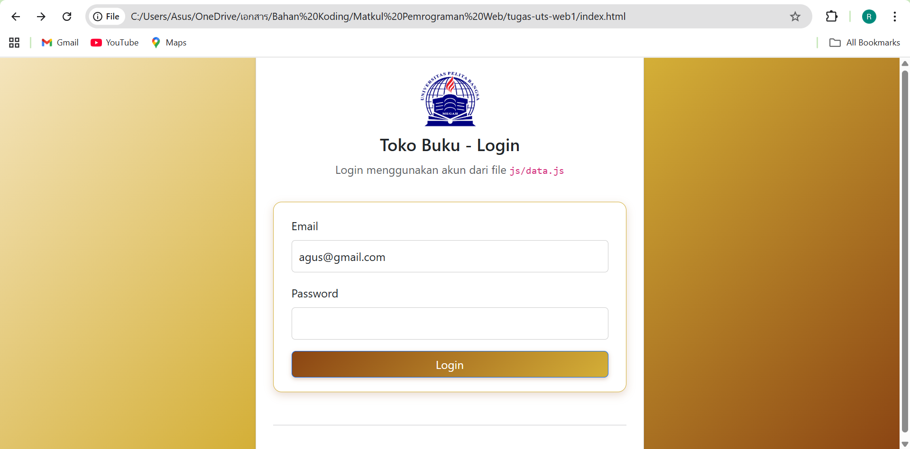
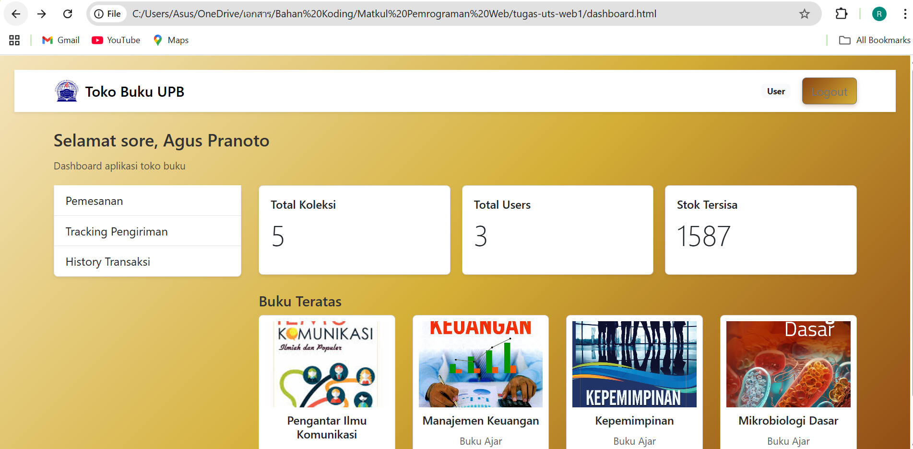
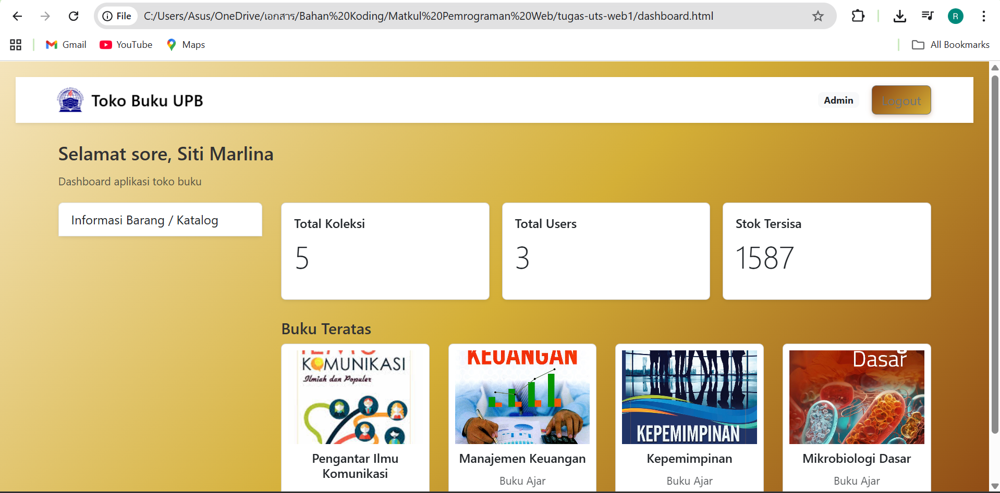
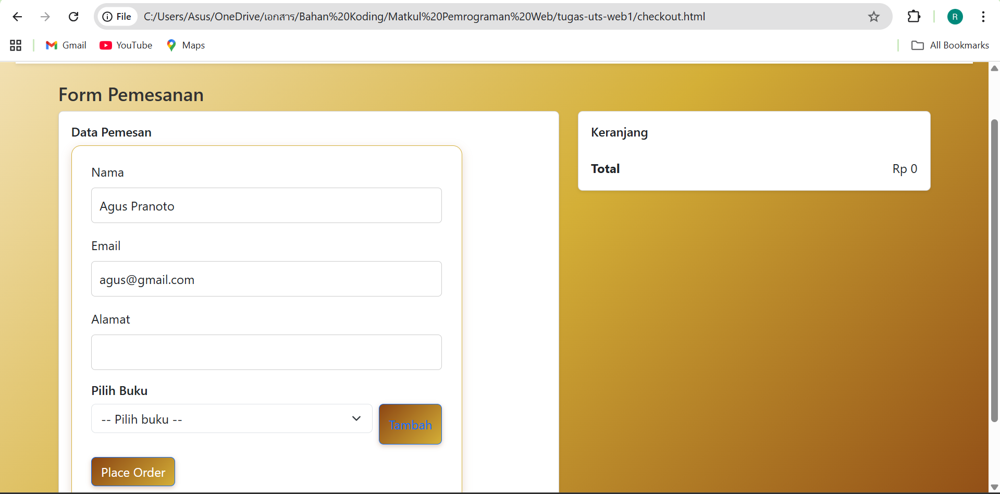
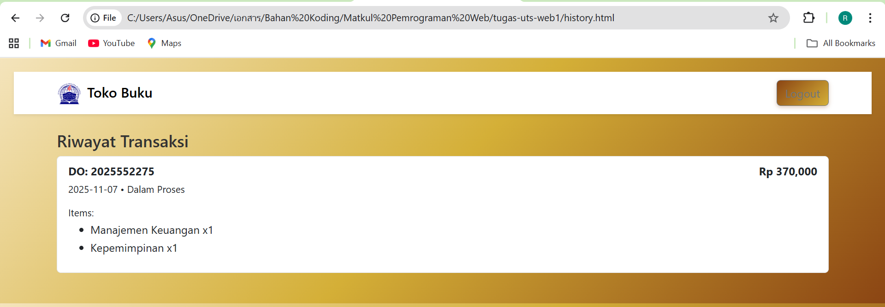
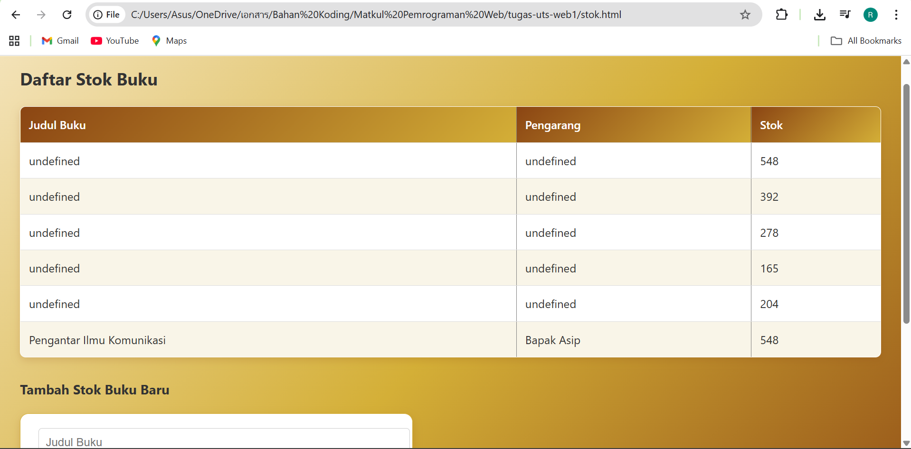

# Pertemuan UTS-Membuat Web Pembelian Buku

Nama : Ahmad Rizky Pramudia Pratama
NIM : 312410272
Kelas : TI.24.A4

Disini saya akan menunjukkan hasil dari pembuatan web penjualan buku
File terdiri dari index.html (login), dashboard.html, (role-based: Admin/User), stok.html (admin only), checkout.html (user only)
tracking.html (user only), css/style.css untuk design webnya, js/data.js dan js/script.js yang isinya data untuk web ini, assets/logo.png dan
img/buku1-dst adalah foto untuk logo web dan sampul buku untuk diweb

Disini ada 3 akun yang bisa login ke web
User: rina@gmail.com / rina123
User: agus@gmail.com / agus123
Admin: siti@gmail.com / siti123

Pertama Buka index.html, login dengan salah satu akun di atas.
Setelah login, akan diarahkan ke dashboard. Navigation menyesuaikan role yang dimaksud (user/admin):

Setelah login, akan masuk ke dashboard seperti ini:

Tapi jika kalian login menggunakan akun admin akan masuk ke dashboard seperti ini:

Kalian bisa memesan buku ke tab Pemesanan lalu lakukan pemesanan, jika sudah melakukan pemesanan buku
kalian bisa cek di bagian riwayat transaksi

Tapi jika kalian login sebagai admin, kalian bisa menambahkan stok buku di tab Katalog

